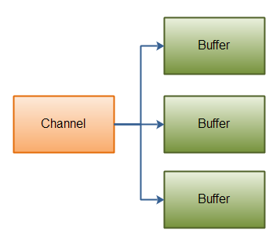

## Java NIO Scatter / Gather

Java NIO发布时内置了对scatter / gather的支持。scatter / gather是通过通道读写数据的两个概念。

Scattering read指的是从通道读取的操作能把数据写入多个buffer，也就是sctters代表了数据从一个channel到多个buffer的过程。

gathering write则正好相反，表示的是从多个buffer把数据写入到一个channel中。

Scatter/gather在有些场景下会非常有用，比如需要处理多份分开传输的数据。举例来说，假设一个消息包含了header和body，我们可能会把header和body保存在不同独立buffer中，这种分开处理header与body的做法会使开发更简明。

### Scattering Reads

"scattering read"是把数据从单个Channel写入到多个buffer，下面是示意图：


**Java NIO: Scattering Read**

用代码来表示的话如下：

```
ByteBuffer header = ByteBuffer.allocate(128);
ByteBuffer body   = ByteBuffer.allocate(1024);

ByteBuffer[] bufferArray = { header, body };

channel.read(bufferArray);
```

观察代码可以发现，我们把多个buffer写在了一个数组中，然后把数组传递给channel.read()方法。read()方法内部会负责把数据按顺序写进传入的buffer数组内。一个buffer写满后，接着写到下一个buffer中。

实际上，scattering read内部必须写满一个buffer后才会向后移动到下一个buffer，因此这并不适合消息大小会动态改变的部分，也就是说，如果你有一个header和body，并且header有一个固定的大小（比如128字节）,这种情形下可以正常工作。

### Gathering Writes

"gathering write"把多个buffer的数据写入到同一个channel中，下面是示意图：


**Java NIO: Gathering Write**

用代码表示的话如下：

```
ByteBuffer header = ByteBuffer.allocate(128);
ByteBuffer body   = ByteBuffer.allocate(1024);

//write data into buffers

ByteBuffer[] bufferArray = { header, body };

channel.write(bufferArray);
```

类似的传入一个buffer数组给write，内部机会按顺序将数组内的内容写进channel，这里需要注意，写入的时候针对的是buffer中position到limit之间的数据。也就是如果buffer的容量是128字节，
但它只包含了58字节数据，那么写入的时候只有58字节会真正写入。因此gathering write是可以适用于可变大小的message的，这和scattering reads不同。