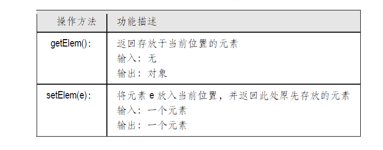

## 数据结构 ☞ 位置
抽象出位置（Position）这一概念，使我们既能够保持链表结构高效性，而又不致违背面向对
象的设计原则。

### 位置ADT
所谓“位置”，就是支持以下方法的一种数据类型



按线性次序排列的一组位置，就构成了一个列表。在列表中，各个位置都是相对而言的⎯⎯相
对于它的前、后邻居。在列表中，除第一个（最后一个）位置外，每个位置都有唯一的前驱（后继）
位置。如果位置p 对应于列表中的某个元素e，那么即使e 在列表中的次序改变了，位置p 也依然
不变。只有在e 被显式地删除之后，位置p 才会相应地被销毁。此外，无论元素e 被替换还是与另
一元素互换，位置p 都不会改变。正是由于位置的这种特性，我们才能够基于位置的概念，为列表
定义出一套以位置对象为参数、返回位置对象的方法。

### 位置ADT 接口
```java
public interface Position<E> {

    /**
     * 获取元素
     * @return
     */
    E getElem();

    /**
     * 将给定元素存放至该位置，返回此前存放的元素
     * @param e 插入元素
     * @return
     */
    E setElem(E e);
}
```