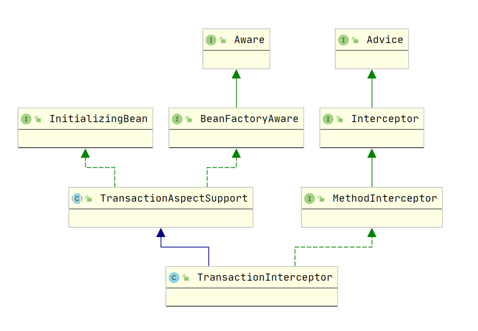
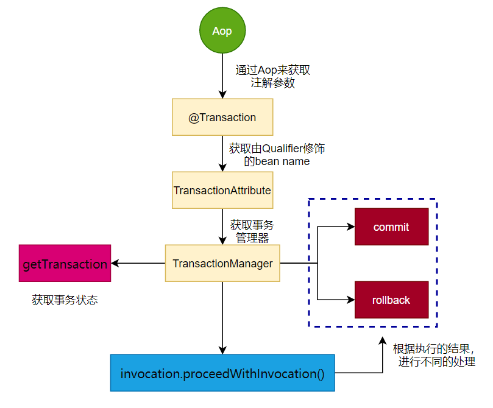

## Spring Transaction 源码分析

作为一个开发人员,大家肯定都了解事务的重要性,在我日常开发中,如果您用的是`Spring`框架,
那您一定知道`@Transaction`这个注解,但是为什么加了注解我们的方法就具有事务了,相比很多人也不是很清楚,
今天就让我们一起来学习一下`@Transaction`背后到了做了什么？

- [起源TransactionInterceptor](#起源TransactionInterceptor)
- [起源TransactionInterceptor](#执行的流程)
- [核心方法介绍](#核心方法介绍)

### 起源TransactionInterceptor

- 介绍
官方的解释：声明性事务的AOP方法拦截器,使用公共Spring事务基础设施进行管理

类图如下:



- invoke方法
```java
@Override
@Nullable
public Object invoke(MethodInvocation invocation) throws Throwable {
	//计算出目标类：可能是 null   
	//TransactionAttributeSource应传递给目标类和方法，该方法可能来自接口。
	Class<?> targetClass = (invocation.getThis() != null ? AopUtils.getTargetClass(invocation.getThis()) : null);
	// 适应TransactionSpectSupport的invokeWithinTransaction
	return invokeWithinTransaction(invocation.getMethod(), targetClass, invocation::proceed);
}
```
```java
@Nullable
protected Object invokeWithinTransaction(Method method, @Nullable Class<?> targetClass,
    	final InvocationCallback invocation) throws Throwable {
    //1. 获取@Transactional注解的相关参数 
    TransactionAttributeSource tas = getTransactionAttributeSource();
    // 2.获取事务的属性，这是主要是针对 Qualifier 对 IOC 注入bean的名字 ，determineTransactionManager会用到
    final TransactionAttribute txAttr = (tas != null ? tas.getTransactionAttribute(method, targetClass) : null);
    // 获取事务管理器
    // 3.1 确定要用于给定事务的特定事务管理器。
    final TransactionManager tm = determineTransactionManager(txAttr);

    ......
    //3.2Spring命令式事务基础结构中的中心接口
    PlatformTransactionManager ptm = asPlatformTransactionManager(tm);
    final String joinpointIdentification = methodIdentification(method, targetClass, txAttr);
    if (txAttr == null || !(ptm instanceof CallbackPreferringPlatformTransactionManager)) {
    	// 使用getTransaction和commit/rollback调用进行标准事务划分
    	TransactionInfo txInfo = createTransactionIfNecessary(ptm, txAttr, joinpointIdentification);
    	Object retVal;
    	try {//这是一个around建议：调用链中的下一个拦截器。
            //这通常会导致调用目标对象。
    		retVal = invocation.proceedWithInvocation();
    	}
    	catch (Throwable ex) {
    		//目标调用异常 事务的回滚
    		completeTransactionAfterThrowing(txInfo, ex);
    		throw ex;
    	}
    	finally {
            //清理当前线程的事务相关信息
    		cleanupTransactionInfo(txInfo);
    	}
    	if (vavrPresent && VavrDelegate.isVavrTry(retVal)) {
    		// 仅在Vavr失败时设置回滚，符合我们的回滚规则
    		TransactionStatus status = txInfo.getTransactionStatus();
    		if (status != null && txAttr != null) {
    			retVal = VavrDelegate.evaluateTryFailure(retVal, txAttr, status);
    		}
    	}
        //提交事务
    	commitTransactionAfterReturning(txInfo);
    	return retVal;
    }
    else {
    	final ThrowableHolder throwableHolder = new ThrowableHolder();
    	// 它是CallbackPreferences Platform TransactionManager:传入TransactionCallback。
        // RuntimeException:将导致回滚。
        //正常返回值：将导致提交。
        // 检查结果状态：它可能指示要重新抛出的丢弃项。
    	}
    }
}
```

### 执行的流程
通过上面的主要代码我们大概知道了一个执行的流程:



### 核心方法介绍
- determineTransactionManager

常用的 PlatformTransactionManager :
```
DataSourceTransactionManager
JtaTransactionManager
```

```java
@Nullable
protected PlatformTransactionManager determineTransactionManager(@Nullable TransactionAttribute txAttr) {
	if (txAttr == null || this.beanFactory == null) {
		return getTransactionManager();
	}
	String qualifier = txAttr.getQualifier();
	//如果指定了Bean则取指定的PlatformTransactionManager类型的Bean
	if (StringUtils.hasText(qualifier)) {
		return determineQualifiedTransactionManager(this.beanFactory, qualifier);
	}
	//如果指定了Bean的名称,则根据bean名称获取对应的bean 
	else if (StringUtils.hasText(this.transactionManagerBeanName)) {
		return determineQualifiedTransactionManager(this.beanFactory, this.transactionManagerBeanName);
	}
	else {
	    // 默认取一个PlatformTransactionManager类型的Bean
		PlatformTransactionManager defaultTransactionManager = getTransactionManager();
		if (defaultTransactionManager == null) {
			defaultTransactionManager = this.transactionManagerCache.get(DEFAULT_TRANSACTION_MANAGER_KEY);
			if (defaultTransactionManager == null) {
				defaultTransactionManager = this.beanFactory.getBean(PlatformTransactionManager.class);
                //如果您这里没有配置其他的事务事务框架，默认返回 DataSourceTransactionManager
                //并且放出到本地缓存key DEFAULT_TRANSACTION_MANAGER_KEY
				this.transactionManagerCache.putIfAbsent(
						DEFAULT_TRANSACTION_MANAGER_KEY, defaultTransactionManager);
			}
		}
		return defaultTransactionManager;
	}
}
```
注: 多数据源是最好配置多个事务管理器，否则会默认创建一个

- createTransactionIfNecessary

1. getTransaction
```java
@Override
public final TransactionStatus getTransaction(@Nullable TransactionDefinition definition)
		throws TransactionException {
	//如果没有给出事务定义，则使用默认值
	TransactionDefinition def = (definition != null ? definition : TransactionDefinition.withDefaults());
	Object transaction = doGetTransaction();
	boolean debugEnabled = logger.isDebugEnabled();
	if (isExistingTransaction(transaction)) {
		// 找到现有事务->检查传播行为以了解如何表现。
		return handleExistingTransaction(def, transaction, debugEnabled);
	}
	// C检查新事务的定义设置
	if (def.getTimeout() < TransactionDefinition.TIMEOUT_DEFAULT) {
		throw new InvalidTimeoutException("Invalid transaction timeout", def.getTimeout());
	}
	// 找不到现有事务->检查传播行为以了解如何继续。
	if (def.getPropagationBehavior() == TransactionDefinition.PROPAGATION_MANDATORY) {
		throw new IllegalTransactionStateException(
				"No existing transaction found for transaction marked with propagation 'mandatory'");
	}
	else if (def.getPropagationBehavior() == TransactionDefinition.PROPAGATION_REQUIRED ||
			def.getPropagationBehavior() == TransactionDefinition.PROPAGATION_REQUIRES_NEW ||
			def.getPropagationBehavior() == TransactionDefinition.PROPAGATION_NESTED) {
		SuspendedResourcesHolder suspendedResources = suspend(null);
		if (debugEnabled) {
			logger.debug("Creating new transaction with name [" + def.getName() + "]: " + def);
		}
		try {
			return startTransaction(def, transaction, debugEnabled, suspendedResources);
		}
		catch (RuntimeException | Error ex) {
			resume(null, suspendedResources);
			throw ex;
		}
	}
	else {
		// 创建“空”事务：没有实际事务，但可能同步
		if (def.getIsolationLevel() != TransactionDefinition.ISOLATION_DEFAULT && logger.isWarnEnabled()) {
			logger.warn("Custom isolation level specified but no actual transaction initiated; " +
					"isolation level will effectively be ignored: " + def);
		}
		boolean newSynchronization = (getTransactionSynchronization() == SYNCHRONIZATION_ALWAYS);
		return prepareTransactionStatus(def, null, true, newSynchronization, debugEnabled, null);
	}
}
```

判断当前事务是否是一个新的事务，否则加入到一个已经存在的事务中。事务传播级别REQUIRED和REQUIRE_NEW有用到。
当前事务是否携带保存点，嵌套事务用到。
setRollbackOnly,isRollbackOnly，当子事务回滚时，并不真正回滚事务，而是对子事务设置一个标志位。
事务是否已经完成，已经提交或者已经回滚。

2. prepareTransactionInfo方法
```java
protected TransactionInfo prepareTransactionInfo(@Nullable PlatformTransactionManager tm,
		@Nullable TransactionAttribute txAttr, String joinpointIdentification,
		@Nullable TransactionStatus status) {

	TransactionInfo txInfo = new TransactionInfo(tm, txAttr, joinpointIdentification);
	if (txAttr != null) {
		if (logger.isTraceEnabled()) {
			logger.trace("Getting transaction for [" + txInfo.getJoinpointIdentification() + "]");
		}
		// 如果已经存在不兼容的tx，事务管理器将标记错误。
		txInfo.newTransactionStatus(status);
	}
	else {
		if (logger.isTraceEnabled()) {
			logger.trace("No need to create transaction for [" + joinpointIdentification +
					"]: This method is not transactional.");
		}
	}
    //我们总是将TransactionInfo绑定到线程，即使我们没有在这里创建新的事务。这保证即使此方面未创建任何事务，TransactionInfo堆栈也将得到正确管理。
	txInfo.bindToThread();
	return txInfo;
}
```

TransactionInfo是对当前事务的描述，其中记录了事务的状态等信息。它记录了和一个事务所有的相关信息。
它没有什么方法，只是对事务相关对象的一个组合。最关键的对象是TransactionStatus，它代表当前正在运行的是哪个事务。

